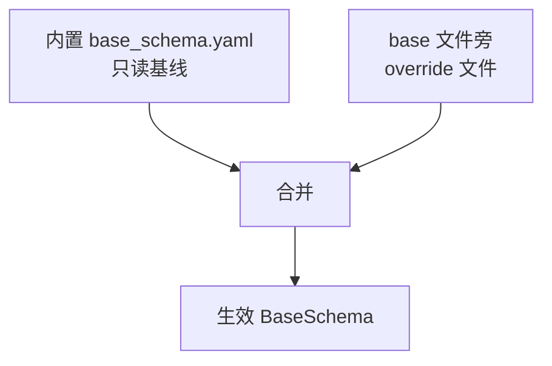

## 背景与目标

客户 base Excel 表头发生漂移（列改名、结构调整）时，当前需要修改内置 `customer_profiles/<profile>/base_schema.yaml` 并发版。本方案提供 UI 化的 per-workspace 覆盖层，让**业务用户自助修复**，无需理解技术概念，无需等待发版。

**用户角色纠正**：单机版无管理员/实施人员，使用者就是做单据的业务用户本人。方案必须：
- 界面不出现「逻辑字段」「内置映射」等技术术语
- 修复方式足够简单：为缺失字段从下拉框选择对应列，无需理解映射概念
- 错误引导场景化：「找不到 PO NO. 列」而非「字段映射缺失」

**范围限定**：仅覆盖 L1 结构映射（`sheets` 和 `field_aliases`），**不开放价格列配置**。

## 核心设计决策

### 1. 存储：覆盖层而非修改内置 YAML



- Override 文件：`<base文件名>.schema.yaml`，存 base 文件同目录
- 稀疏补丁格式，只存与内置的差异
- **共享盘团队零同步**：多个人打开同一个 base 文件，自动共享修复结果

### 2. 修复方式：下拉选择对应列

数据检查发现「找不到必需的列」时，用户在修复向导中为每个缺失字段**直接从下拉框选择**文件中实际存在的列。下拉候选 = 该 Sheet 中所有未被其他字段占用的表头。不做系统自动推荐/相似度打分，选择完全由用户确认。

## 实施方案

### Phase 1：后端覆盖层机制（2-3 天）

**1. Schema 合并逻辑** - [packages/ro_generator/src/ro_generator/base_schema.py](packages/ro_generator/src/ro_generator/base_schema.py)

- 新增 `BaseSchema.with_override(override_dict)` 方法
- 校验：字段键必须在核心包契约内，拒绝 `price_columns` 等敏感配置
- 扩展 `base_schema()` 缓存：键从 `profile_id` 改为 `(profile_id, override_path, override_mtime)`

**2. 缺失字段与候选列** - 新增 `packages/ro_generator/src/ro_generator/schema_inspect.py`

```python
def inspect_schema_issues(
    schema: BaseSchema,
    actual_headers_by_sheet: dict[str, list[str]],
) -> list[SchemaIssue]:
    """返回缺失的逻辑字段及其所在 Sheet 的可用候选表头。

    SchemaIssue = (field, expected, sheet, available_headers)
    available_headers：该 Sheet 中未被其他字段占用的实际表头，供前端下拉选择。
    不做相似度推荐/打分，选择完全由用户确认。
    """
```

- 遍历逻辑字段，定位在内置 schema 下找不到对应表头的字段
- 候选列 = 该 Sheet 实际表头中未被其他逻辑字段占用的部分

**3. Workspace 扩展** - [packages/ro_workbench_api/src/ro_workbench_api/workspace_store.py](packages/ro_workbench_api/src/ro_workbench_api/workspace_store.py)

- `CustomerWorkspace` 新增 `schema_override_path: str | None`（默认自动推导为 `<base_file>.schema.yaml`）
- 配置文件版本 v1 → v2，`migrate_payload` 处理旧版本

**4. Session 集成** - [packages/ro_workbench_api/src/ro_workbench_api/session_manager.py](packages/ro_workbench_api/src/ro_workbench_api/session_manager.py)

- 打开 session 时检测 override 文件，存在则加载合并
- Override 变更后使 `WorkbookCacheManager` 快照失效

**5. API 端点** - [packages/ro_workbench_api/src/ro_workbench_api/app.py](packages/ro_workbench_api/src/ro_workbench_api/app.py)

```
GET    /api/workspaces/{id}/schema/issues
       # 检测当前 schema 问题，返回缺失字段 + 候选列
       # 响应：{ issues: [{field, expected, sheet, available_headers: [...]}] }

POST   /api/workspaces/{id}/schema/override
       body: { sheets: {...}, field_aliases: {...} }
       # 保存 override（需先通过 PIN 校验），使快照失效，返回验证结果

DELETE /api/workspaces/{id}/schema/override
       # 恢复内置（用户清除自定义设置，需 PIN）

GET    /api/workspaces/{id}/schema/validate
       # 用当前生效 schema 重跑 validate_workbook_structure
```

### Phase 2：前端修复向导（2-3 天）

**1. 错误引导入口** - [frontend/src/views/DataCheck.vue](frontend/src/views/DataCheck.vue)（或对应组件）

当 `validate_workbook_structure` 报错时，错误提示从：

> ❌ PO record 缺少必需表头：PO NO.

改为：

> ❌ 在「PO record」工作表中找不到「PO NO.」列
> 
> 可能原因：列名被修改（如改为 PO NUMBER）或列位置调整
> 
> [修复列对应关系]  [查看原始文件]

**2. 修复向导**（内联在「数据检查」tab） - 新增 `frontend/src/components/data-view/SchemaRepairPanel.vue`

```text
┌──────────────────────────────────────────────────────────────┐
│  修复列对应关系                                              │
│  请按表格和原列名核对，再在「对应到」中选择文件里的实际列      │
├──────────┬────────┬──────────────┬───────────────────────────┤
│ 数据字段 │ 表格    │ 原列名       │ 对应到                    │
├──────────┼────────┼──────────────┼───────────────────────────┤
│ SAP      │ DATA   │ SAP          │ [ 请选择 ▼ ]              │
│          │ BASE   │              │                           │
│ Combo 单价│ DATA  │ EMAX PTE     │ [ 请选择 ▼ ]              │
│          │ BASE   │ COMBO FOB …  │                           │
├──────────┴────────┴──────────────┴───────────────────────────┤
│                                    [保存并重新校验]          │
└──────────────────────────────────────────────────────────────┘
```

**交互流程**：
1. 数据检查报错时，阻断面板 / 表格上方提示条带「修复列对应关系」入口
2. 点击进入修复向导（若已设 PIN，先弹 PIN 校验，通过后进入）
3. 每个缺失字段一个下拉框，候选 = 该 Sheet 中未被占用的实际表头，用户直接选择
4. 保存后立即调用 `/schema/validate`，显示「验证通过」或剩余问题
5. 「恢复默认设置」二次确认后删除 override 文件

### Phase 3：测试与文档（1 天）

**测试**：

- `base_schema.with_override` 合并逻辑单测
- `schema_inspect` 缺失字段识别与候选列计算单测
- API 端点集成测试（含 PIN 校验：未设 PIN / PIN 正确 / PIN 错误 / 锁定）
- E2E 场景：修改表头 → 错误提示 → PIN 校验 → 下拉选择修复 → 导出成功

**文档更新**：

- [docs/development/ro-document-workbench-ui-design.md](docs/development/ro-document-workbench-ui-design.md)：新增表头修复向导
- [docs/product/multi-customer-workspace-design.md](docs/product/multi-customer-workspace-design.md)：补充 override 机制
- [README.md](README.md)「配置文件」章节：补充表头修复入口
- [AGENTS.md](AGENTS.md)「编辑、缓存和 session」：说明 override 失效链路

## 关键代码片段

**Override 文件格式**（`PO RECORD 2026.schema.yaml`）：

```yaml
# 用户不需要看到这个文件，它只是技术实现
sheets:
  PO record:
    header_row: 2
field_aliases:
  PO record:
    po_no: PO NUMBER
```

**缺失字段识别**（`schema_inspect.py`）：

```python
@dataclass(frozen=True)
class SchemaIssue:
    field: str
    expected: str
    sheet: str
    available_headers: tuple[str, ...]  # 该 Sheet 中未被占用的实际表头

def inspect_schema_issues(
    schema: BaseSchema,
    actual_headers_by_sheet: dict[str, list[str]],
) -> list[SchemaIssue]:
    """返回缺失的逻辑字段及其候选表头，供前端下拉选择。"""
    issues = []
    for sheet_name, fields in schema.field_aliases.items():
        actual = actual_headers_by_sheet.get(sheet_name, [])
        claimed = {v for k, v in fields.items() if v in actual}
        free = [h for h in actual if h not in claimed]
        for field_key, expected in fields.items():
            if expected not in actual:
                issues.append(SchemaIssue(field_key, expected, sheet_name, tuple(free)))
    return issues
```

**API 响应示例**（`GET /schema/issues`）：

```json
{
  "issues": [
    {
      "field": "po_no",
      "field_label": "PO 号",
      "expected": "PO NO.",
      "sheet": "PO record",
      "available_headers": ["PO NUMBER", "ITEM LINE#", "SHIPQTY", "INV#"]
    }
  ]
}
```

## 权限管控：系统校验码（软管控）

列对应关系修改使用 **系统校验码**，界面不提供设置、更改或清除。只有知道此码的人能进入修复向导。定位为**软管控**：防别人随手改配置，不防有意绕过（任何能打开本机文件的人理论上都能改 YAML，不做硬加密）。

**模型**：

- **读取 / 自动加载**：无校验码要求，打开 base 文件自动应用 override
- **进入修复向导**：必须输入当前生效的校验码（未验证前看不到编辑界面）
- **保存 / 删除 override**：进入向导时已校验，保存直接生效
- **校验码本身**：界面不可改；改本机配置文件即可，不必重新发版

**存储**：

- 本机文件：与 `workspaces.json` 同目录的 `schema_pin.txt`（默认 `platformdirs.user_config_dir("RO Workbench")`，便携模式跟 `RO_WORKBENCH_CONFIG_DIR`）
- 首次启动若文件不存在，写入内置默认码 `sk001`，之后改文件即生效（下次输入时重读，不必重启发版）
- 文件缺失、空或只有注释时回退到代码里的默认码
- 不写入 `workspaces.json`；旧版 `pin_hash` 会被忽略

**交互**：

- 用户点击「修复列」→ 本次会话未验证过 → 弹出输入框
- 验证通过后进入修复向导，本次会话内记住，避免重复输入
- 连续输错 5 次锁定 10 分钟（前端计时，防暴力试）

**边界（需在 UI 文案中明确）**：校验码只约束**通过本工具界面的修改**，不能阻止直接编辑 override YAML 文件。共享盘场景下若需更强管控，应通过文件系统权限（只读共享 + 可写账号）实现，与本机制互补。

## 风险与边界

1. **不开放价格列**：`data_base_price_columns` 等仍走 YAML/发版流程（改错算错金额）
2. **字段键只读**：用户只能改映射值，不能增删逻辑字段
3. **验证闭环**：保存后立即重跑 `validate_workbook_structure`，失败明确提示
4. **缓存失效**：override 变更使快照失效，下次打开重建
5. **PIN 软管控边界**：仅约束工具界面内的保存操作，见「权限管控」一节

## 用户场景示例

**场景 1：客户改版表头**

1. 用户打开 base 文件，数据检查报错：「找不到 PO NO. 列」
2. 点击「修复列对应关系」，输入系统校验码进入修复向导
3. 在「对应到」中为该数据字段选择文件里的实际列
4. 点击「保存并验证」
5. 提示「验证通过」，数据检查正常显示

**场景 2：同一台电脑（系统校验码管控）**

1. 授权人员输入系统校验码，修复了表头对应关系
2. 同事 B 用同一台电脑打开同一个 base 文件，自动加载 override，无需任何操作
3. 同事 B 点击「修复列」，被校验码输入框拦住，需向授权人员获取系统校验码

## 后续可选增强（不在本期）

- 配置变更历史（本地 JSON 日志，支持回滚）
- L2/L3 配置化（字段来源规则、取数算法）
