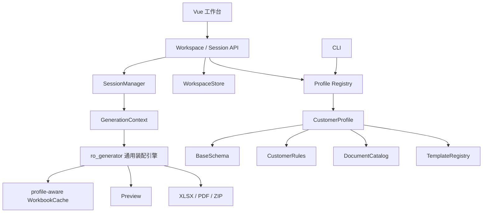
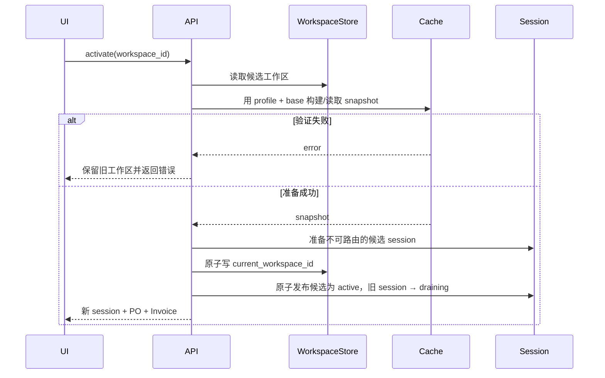

# 多客户工作区设计

> 状态：Phase 4.5–6 的多工作区基础已经完成；Phase 7 已接入第二个 Customer Profile `pf`，包含独立 schema、10 份模板/mapping、客户 PO 先行流程、月度出货数量、PF 发票号、MOQ/整箱提醒和分离 Invoice/PL 打包。RO 仍是默认 Profile。
>
> 适用范围：本地单用户桌面应用，不引入登录、账号、权限或云端同步。

## 1. 背景

工作台最初只面向 RO 客户，因此旧实现存在以下单客户假设；这些假设现已通过 Profile/Workspace 机制解除：

- 旧入口默认使用 RO schema 和规则；新入口通过 `GenerationContext` 显式绑定 Profile。
- 主体、链段、价格、数量和客户校验由当前 Profile 规则提供。
- template mapping 根据当前 Profile 根目录和 manifest 资产声明查找。
- API session 同时保存 `workspace_id`、`profile_id` 和 `base_file`。
- workbook 缓存已按 `(profile_id, resolved_base_path)` 区分，避免不同 Profile 复用快照。
- 前端通过 Workspace API 保存多个配置并只维护一个 `current_workspace_id`。
- 业务请求通过 session 取得已验证的 Profile/base 身份。

直接增加第二客户会导致客户判断散落在 resolver、规则模块、API 和前端中。为了保持 RO 输出稳定，同时支持快速切换客户，需要引入两个明确边界：

1. **Customer Profile**：程序内置的客户业务定义。
2. **Customer Workspace**：用户配置的 Profile 与本地 base 文件组合。

## 2. 目标

- 用户可配置多个客户工作区。
- 顶部栏可以快速切换，不必进入设置页。
- 应用任一时刻只有一个当前工作区和一个可执行业务操作的 active session。
- 启动时自动恢复上次成功使用的工作区。
- 切换失败时继续保留旧工作区，不进入空白或半切换状态。
- Profile、base 文件、snapshot、模板、导出和 session 全程绑定。
- 当前 RO 的预览、校验、文件名和导出结果保持兼容。
- 新客户的差异集中在 Profile 配置和策略中，不在通用模块增加散落的客户判断。

## 3. 非目标

- 不增加用户登录。
- 不增加多用户或多进程协作编辑。
- 不允许同时并排操作两个客户。
- 不做远程配置同步。
- 不自动从网络下载 Profile 或模板。
- 不允许用户在设置页修改 Profile 内部字段、价格、模板或业务规则。
- 不在本迭代引入导出历史、撤销/重做或数据库。

## 4. 术语

### 4.1 Customer Profile

程序随版本发布的只读客户定义，包含：

- Profile ID 和显示名称。
- base schema。
- 主体、链段和支持单据。
- template/mapping registry。
- 字段和业务规则策略。
- 发票分组和文件命名策略。
- Profile 检测特征。

Profile 不能由普通用户在设置页修改；更新 Profile 等同于更新程序业务规则。

### 4.2 Customer Workspace

用户在本机创建的配置：

```text
Customer Profile + Base File + 显示名称
```

同一客户可以配置多个工作区，例如 `RO 2026`、`RO 测试`。因此 UI 和持久化层使用“工作区”，不把客户名称直接作为唯一键。

### 4.3 Current Workspace

`current_workspace_id` 指向上次成功激活的工作区。配置中不保存多行 `active: true/false`，从数据结构上保证只有一个当前工作区。

### 4.4 Active Session

当前允许执行检查、编辑、预览和导出的 session。切换后旧 session 进入 `draining`，只允许在短暂宽限期内下载已经生成的文件。

## 5. 总体架构



核心原则：任何业务入口都必须先解析出明确的 `CustomerProfile`，内部函数不得读取“全局当前客户”。

## 6. Profile 模型

建议核心数据结构：

```python
@dataclass(frozen=True)
class CustomerProfile:
    id: str
    version: str
    display_name: str
    base_schema: BaseSchema
    document_catalog: DocumentCatalog
    templates: TemplateRegistry
    rules: CustomerRules
    naming: NamingPolicy
    currencies: tuple[str, ...]


@dataclass(frozen=True)
class GenerationContext:
    profile: CustomerProfile
    base_file: Path
```

`CustomerProfile.id` 是稳定机器 ID，例如 `ro`；修改显示名称不能改变 ID。`version` 用于诊断 Profile 与模板是否匹配。

`GenerationContext` 是一次读取、检查、预览或导出的不可变执行上下文。`base_file` 在创建时规范化为绝对路径；旧的 `GenerationRequest.base_file` 由兼容入口转换为 context，长期目标是不在内部对象之间重复传递两份可冲突的路径。

### 6.1 Profile registry

Profile 只能通过内置 registry 加载：

```python
get_profile("ro")
list_profiles()
```

YAML 中只能引用预注册的 `rules_key` 和 `naming_key`，不能填写任意 Python import path，避免配置执行代码。

### 6.2 配置与代码边界

放入 Profile YAML：

- Sheet 和表头。
- 主体、链段。
- 支持单据矩阵。
- mapping 路径。
- bundle 组合。
- 币种。
- 检测特征。
- 固定显示信息。

保留为 Python strategy：

- 主体过滤。
- 单价选择。
- 数量选择。
- 发票号转换。
- 票据组标识。
- 客户特有校验。
- 文件命名中的复杂规则。

不引入能够表达任意条件的 YAML 业务 DSL。

### 6.3 CustomerRules

策略接口至少覆盖当前 RO 特有行为：

```python
class CustomerRules(Protocol):
    def buyer_for_seller(self, seller: str) -> str | None: ...
    def seller_for_line(self, line: OrderLine) -> str | None: ...
    def filter_lines(self, lines, seller, documents): ...
    def price_segment(self, document, seller, buyer): ...
    def invoice_no_for_line(self, line, document, seller): ...
    def invoice_group_identifiers(self, line): ...
```

字段来源规则仍可复用 `line_rules.py`、`header_rules.py` 和 `totals_rules.py` 的声明式数据结构，但这些规则集必须归属于 Profile，而不是进程级全局表。

## 7. Profile 资产目录

目标目录：

```text
customer_profiles/
  ro/
    profile.yaml
    base_schema.yaml
    templates/
      gs/
      emax/
      sk/
      ym/
  pf/
    profile.yaml
    base_schema.yaml
    templates/
      ...
```

Python 策略位于：

```text
packages/ro_generator/src/ro_generator/profiles/
  base.py
  registry.py
  ro.py
  pf.py
```

`profile.yaml` 示例：

```yaml
profile_version: "1"
id: ro
display_name: Rather Outdoors
rules_key: ro_v1
naming_key: ro_v1
base_schema: base_schema.yaml
currencies: [USD]

sellers:
  SK:
    buyer: YM
    documents: [PI, INVOICE, PL, CI, RO_PL]
  YM:
    buyer: GS PTE
    documents: [PI, INVOICE, PL, CI, RO_PL]
  GS PTE:
    buyer: EMAX PTE
    documents: [PI, PO, INVOICE, PL]
  EMAX PTE:
    buyer: PF
    documents: [PI, PO, INVOICE, PL]

bundles:
  - [INVOICE, PL]
  - [CI, RO_PL]

mappings:
  # 路径均相对当前 Profile 根目录
  SK:
    PI: templates/sk/mappings/pi.yaml
    INVOICE: templates/sk/mappings/invoice.yaml
    PL: templates/sk/mappings/pl.yaml
    CI: templates/sk/mappings/ci.yaml
    RO_PL: templates/sk/mappings/ro_pl.yaml
```

模板路径以 Profile 根目录解析，禁止继续依赖 `yaml_path.parent.parent.parent.parent` 之类的固定层级计算。

PyInstaller 只需整体打包 `customer_profiles/`。新 Profile 不应要求修改 launcher 业务代码。

## 8. Workspace 持久化

### 8.1 数据结构

```python
@dataclass(frozen=True)
class CustomerWorkspace:
    id: str
    display_name: str
    profile_id: str
    base_file: str
    created_at: str
    updated_at: str
    last_opened_at: str | None


@dataclass(frozen=True)
class WorkspaceSettings:
    schema_version: int
    current_workspace_id: str | None
    workspaces: tuple[CustomerWorkspace, ...]
```

JSON 示例：

```json
{
  "schema_version": 1,
  "current_workspace_id": "ro-2026",
  "workspaces": [
    {
      "id": "ro-2026",
      "display_name": "RO 2026",
      "profile_id": "ro",
      "base_file": "/data/ro/RO DATA BASE.xlsx",
      "created_at": "2026-08-07T10:00:00+08:00",
      "updated_at": "2026-08-07T10:00:00+08:00",
      "last_opened_at": "2026-08-07T10:00:00+08:00"
    }
  ]
}
```

### 8.2 保存位置

使用 `platformdirs.user_config_dir()`：

```text
macOS:   ~/Library/Application Support/RO Workbench/workspaces.json
Windows: %APPDATA%/RO Workbench/workspaces.json
```

测试和便携场景使用环境变量覆盖：

```text
RO_WORKBENCH_CONFIG_DIR
```

### 8.3 写入保证

- 进程内 `RLock`。
- 在目标目录创建临时文件。
- flush + fsync。
- `os.replace()` 原子替换。
- 保留 `schema_version`。
- 解析失败时不覆盖原文件，返回 `WORKSPACE_CONFIG_INVALID`。

当前为单进程桌面程序，不增加跨进程文件锁或 SQLite。

## 9. Workspace 状态

持久化记录不保存易过期的 `valid` 布尔值。API 按需计算：

```text
unchecked
ready
file_missing
permission_denied
profile_not_found
schema_mismatch
```

文件可能在应用外被移动或修改，因此 `last_validated_at` 只能作为展示信息，不能跳过激活时校验。

## 10. 激活事务

激活必须遵循“先准备，后切换”：



激活过程由全局 activation lock 串行化。候选 session 在发布前不能被业务端点访问；只有 snapshot 和业务检查成功后，才能更新 `current_workspace_id`，随后在同一临界区切换 active session 指针。若提交后的内存发布异常，立即恢复旧 `current_workspace_id` 并丢弃候选 session。进程在两步之间崩溃时，下一次启动由 bootstrap 根据已持久化工作区重新创建 session。

切换期间前端禁用编辑、预览和导出操作。激活失败时不得清空现有 store。

## 11. Session 和下载

`SessionInfo` 扩展为：

```python
@dataclass
class SessionInfo:
    session_id: str
    workspace_id: str
    profile_id: str
    base_file: str
    temp_dir: str
    state: Literal["active", "draining"]
    created_at: float
    last_access: float
    drain_until: float | None
```

规则：

- 任一时刻只有一个 `active` session。
- PO/Invoice/preview/edit/export 只接受 active session。
- 旧 session 进入 `draining` 后只允许 `/api/download`。
- draining 宽限期建议 5 分钟，之后删除临时目录。
- 普通 active session 继续使用当前一小时无活动 TTL。
- `/api/session/close` 关闭 active session 时不删除 workspace 配置。

业务端点从 session 获取 `profile_id` 和 `base_file`，不再信任请求体或 query 中重复传入的路径。

## 12. Profile-aware 缓存

当前缓存 key 只有 base 文件绝对路径。改为：

```python
CacheKey = tuple[str, str]  # (profile_id, resolved_base_path)
```

文件签名继续使用 size + mtime_ns，保存在 cache entry 中并在命中时复核；签名变化后替换同一逻辑 key 的 snapshot，不把旧签名长期保留为另一个 key。`WorkbookSnapshot` 增加 `profile_id`，构建时必须显式接收 Profile。

接口：

```python
get_snapshot(profile, base_file)
invalidate(profile_id, base_file)
```

同一路径使用不同 Profile 时不得共享 snapshot 或 build lock。

缓存 TTL 保持当前 30 分钟；session TTL 保持一小时。

## 13. API

### 13.1 新增端点

```text
GET    /api/profiles
GET    /api/workspaces
POST   /api/workspaces
PATCH  /api/workspaces/{workspace_id}
DELETE /api/workspaces/{workspace_id}
POST   /api/workspaces/validate
POST   /api/workspaces/{workspace_id}/validate
POST   /api/workspaces/{workspace_id}/activate
GET    /api/bootstrap
```

### 13.2 创建和修改

请求：

```json
{
  "display_name": "RO 2026",
  "profile_id": "ro",
  "base_file": "/data/ro/base.xlsx"
}
```

工作区 ID 由后端生成，不根据显示名称或路径推导。修改当前工作区的 Profile/base 后必须重新激活；旧 session 在重新激活前继续绑定旧不可变上下文。

表单中的“检测路径”使用 `POST /api/workspaces/validate`，请求 Profile 和 base 文件但不创建或修改工作区。返回 `WorkspaceStatus` 和可读说明；用户确认后再调用创建/修改接口。已有工作区的“检测”使用带 `workspace_id` 的接口。

### 13.3 激活响应

激活一次返回完整启动数据，避免前端进入多请求中间态：

```json
{
  "workspace": {
    "id": "ro-2026",
    "display_name": "RO 2026",
    "profile_id": "ro",
    "profile_name": "Rather Outdoors",
    "base_file": "/data/ro/base.xlsx",
    "base_file_name": "base.xlsx"
  },
  "session_id": "abc123",
  "po_list": [],
  "invoices": []
}
```

### 13.4 Bootstrap

`GET /api/bootstrap`：

- 返回 Profile 列表和工作区摘要。
- 如果存在 `current_workspace_id`，尝试执行与 activate 相同的校验和打开逻辑。
- 成功时返回 session、PO 和 Invoice。
- 失败时返回工作区列表、当前配置及可识别错误，但不静默激活其他客户。
- 没有工作区时返回 `needs_setup: true`。

### 13.5 兼容端点

现有 `/api/session/open` 在兼容期保留：

- 视为临时 `ro` Profile 打开。
- 不修改 `current_workspace_id`。
- 没有持久化当前工作区时，可以替换另一个临时 legacy session。
- 已有持久化当前工作区时，只允许打开与该工作区 Profile/base 一致的 session；不同路径返回 `WORKSPACE_ACTIVATION_REQUIRED`，要求调用工作区激活接口，避免“持久化当前工作区”和 active session 指向两个客户。
- 响应保持兼容。
- 标记 deprecated，并在前端迁移完成后仅供旧调用者使用。

现有 PO request 中的 `base_file` 第一阶段允许存在但忽略，以 session 为准；第二阶段确认无外部调用后再从模型删除。

## 14. 前端体验

### 14.1 顶部切换器

顶部栏主入口：

```text
当前工作区：[RO 2026 · base.xlsx ▾]       [系统设置]
```

菜单内容：

```text
✓ RO 2026              base.xlsx
  客户 B               customer-b.xlsx
────────────────────────────────────
+ 新增客户工作区
  管理工作区…
```

菜单显示当前状态，但不在后台自动验证所有大文件。只有激活和显式“检测”读取 workbook。

### 14.2 设置页面

设置页管理：

- 显示名称。
- Customer Profile。
- base 文件绝对路径。
- 路径/Profile 检测。
- 设为当前工作区。
- 删除非当前工作区。

新增/编辑表单在 base 路径字段旁提供“检测路径”按钮。检测过程中显示 loading；返回结果至少区分可用、文件不存在、无权限、Profile 不存在和格式不匹配。检测只读取当前表单中的 Profile 与路径，不自动创建或修改工作区；用户修改 Profile 或路径后，旧检测结果立即失效。

当前工作区删除必须先明确切换或确认进入未配置状态。

新增和编辑采用独立的二级表单对话框，不嵌在工作区列表底部：

- 工作区列表页只负责浏览、检测、激活和进入编辑；底部操作为“关闭设置”。
- 新增/编辑打开表单对话框，表单只提供“取消”和“保存工作区”。
- 表单打开时，列表页的关闭按钮和其它列表操作不可操作，避免把“保存配置”和“关闭设置”误认为同一个动作。
- 保存成功后关闭表单并回到列表，显示“配置已保存，请重新检测并激活”或对应结果。

### 14.3 切换行为

- `switchingWorkspace` 为 true 时禁用编辑和导出。
- 旧页面内容保留并覆盖 loading mask，不先清空。
- 激活成功后一次性替换 session、列表和选择状态。
- 默认选择第一个非 blocked PO/Invoice，规则沿用当前 store。
- 激活失败显示错误并恢复旧内容。

### 14.4 启动和迁移

首次运行新版本：

1. 调用 bootstrap。
2. 如果后端没有 workspace，读取旧 `ro-workbench-base-path`。
3. 有旧路径时创建 `RO` 工作区并尝试激活。
4. 只有创建和激活成功后才删除旧 localStorage key。
5. 失败时保留旧 key，打开设置并显示原因。

后续启动完全由后端 workspace 配置恢复，不再以 localStorage 为事实源。

## 15. CLI

新增可选参数：

```text
--profile ro
```

兼容策略：

- 未指定时默认 `ro`。
- CLI 不读取 GUI 的 `current_workspace_id`，保证脚本可重复。
- CLI 仍显式接收 `--base`。
- 未知 Profile 返回参数错误 2。

## 16. 错误契约

新增稳定错误 code：

```text
PROFILE_NOT_FOUND
PROFILE_CONFIG_INVALID
WORKSPACE_NOT_FOUND
WORKSPACE_CONFIG_INVALID
WORKSPACE_FILE_MISSING
WORKSPACE_FILE_PERMISSION_DENIED
WORKSPACE_SCHEMA_MISMATCH
WORKSPACE_ACTIVATION_IN_PROGRESS
WORKSPACE_ACTIVATION_REQUIRED
SESSION_INACTIVE
```

底层 workbook 校验错误继续保留原 code，不统一折叠为字符串。

## 17. 安全与一致性

- 业务端点不接受任意前端路径作为最终文件权限来源。
- Workspace base 路径必须解析为绝对路径。
- 下载仍限制在 session temp directory。
- 激活锁防止两个快速点击产生两个 active session。
- Profile registry 不加载外部 Python 代码。
- 配置文件不包含业务数据内容或凭据。
- 删除/修改工作区只影响配置，不删除 base 文件。
- 切换客户不会自动修改任何 workbook。

## 18. RO 兼容要求

Profile 重构完成后，下列结果必须保持：

- 三张 Sheet 和字段别名。
- 四段主体链和 Category 过滤。
- PI/PO 与票据类数量来源。
- 各主体发票号规则。
- 18 份 mapping 的模板选择。
- Invoice+PL、CI+RO_PL bundle。
- 文件名、ZIP 名和冲突策略。
- warning/blocking/missing_inputs code。
- 结构化预览 payload。
- Excel 样式和 PDF 路径。
- CLI 默认行为和退出码。

## 19. 验收标准

- 可以保存至少两个工作区，并从顶部栏切换。
- 配置结构只能表达一个 `current_workspace_id`。
- 重启应用自动恢复上次成功工作区。
- 候选工作区无效时，旧工作区继续可用。
- 切换成功后所有业务请求使用新 Profile/base。
- 旧 session 不能继续编辑、预览或导出，但宽限期内可以下载已有文件。
- 同一路径在不同 Profile 下不共享缓存。
- 旧 localStorage 路径只迁移一次且失败可重试。
- RO 全量回归通过，黄金输出没有业务变化。
- CLI 未指定 Profile 时仍按 RO 执行。
- PyInstaller 包含全部 Profile 资产。

## 20. 新客户接入门槛与 PF 落地结果

实现新 Customer Profile 前必须提供：

- 一份脱敏 base workbook。
- 每种单据至少一份批准输出。
- Sheet/字段说明。
- 主体、链段和币种。
- 单价和数量来源。
- 发票号和跨 PO 分组规则。
- 必填/警告字段。
- 文件命名和 bundle 规则。
- Excel/PDF 交付要求。

只有完成差异矩阵后，才能判断该客户是纯配置接入还是需要新的 Python strategy。

PF 已按上述门槛完成首轮接入，当前差异如下：

| 维度 | RO | PF |
| --- | --- | --- |
| Profile ID | `ro` | `pf` |
| Sheet | `DATA BASE` / `PO record` / `客户PO` | `DATA BASE TEMPLATE` / `PO RECORD 26` / `new PO template` |
| Category | `1/2/3` | `Combo` / `Single Rod` / `Single Reel` |
| 新 PO 来源 | 必须先进入 `PO record` | 可先存在于 `new PO template`，用于 PI/PO |
| Invoice/PL 数量 | `SHIP QTY` | 根据 `INV#` 中的 YYMM 读取 `2601`–`2612` 月度列 |
| EMAX 发票号 | `INV#` 加 `-P` | 保持 `INV#` 原值 |
| 订单提醒 | RO 原有校验 | 按 SAP 聚合客户订单数量，检查 `MOQ` 与 `round value` |
| Invoice/PL 交付 | 同模板时合并为双 Sheet workbook | 两个独立模板分别生成，并打入同一 ZIP |
| PL 装箱 | RO 既有 PO record 口径 | 按月度出货数量重算箱数，并按原订单总量比例换算重量、按尺寸重算 CBM |

PF 的两项订单规则均返回非阻断、`severity: high` 的 warning：

- `MOQ_NOT_MET`：订单数量低于 `DATA BASE TEMPLATE.MOQ`；
- `FULL_CARTON_NOT_MET`：订单数量不是 `round value` 的整数倍。

同一 PO 中相同 SAP 的多行先合并数量再检查，提示定位到 `new PO template` 的 `Order Quantity`。当前 6 个新 PF PO（`4500752093`–`4500752098`）均满足两项规则，因此真实文件校验不产生误报。

PF Invoice 模板保留了“cost breakdown and actual manufacturer breakdown”预留区，但业务资料尚未定义其可靠字段来源，系统不会自动编造；该区域当前保持空白。
